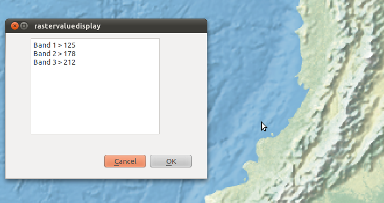

=============================
Exercises
=============================

1. Expanding the Tutorial Plugin
--------------------------------

You might have noticed there's a couple interesting things happening in the module\  ``vector_selectbypoint.py`` \from the tutorial. Let's talk about some changes and then move around some code in the next example: 

    1. Everytime we click the map canvas a signal is sent out, and our slot (or handler function)\  ``selectFeature()`` \runs and does a number of things before selecting a feature:
        * gets the current layer
        * gets the current layer's data provider

This doesn't seem like the most intuitive place to get the current layer and it's data provider. Let's make this simplier by reorganizing things around events. Whenever a layer is selected in the TOC it will fire a signal. This seems like a good place to put any intialization code for the current layer or data provider since we'll be handling layers one-at-a-time. 

    2. Relaying the QgsPoint X,Y coordinates isn't putting our TextBrowser to great use.

Let's output something more useful then. We want to output a 'NAME' attribute to the TextBrowser if it exists for a given layer. 

------------------------------

Most of what we have to do to implement these changes is code reorganization. 

\  **1.** \First, let's work on our class variables -- those variables under\  ``__init__()`` \. We want to ensure that everytime a selection is made that we have a class variable to hold:

    * our list of selected features
    * our current layer
    * our current layer's data provider

The reason we want these to be class variables instead of function variables is because we want ALL functions to be able to access and make decisions based on their value. Currently all these variables are set in\  ``selectFeature()`` \function. That means we'll have to move the\  ``selectList`` \variable out from the\  ``selectFeature()`` \function and put it under\  ``__init__()`` \ as well as\  ``cLayer`` \and\  ``provider`` \variables. So make your\  ``__init__()`` function look like this::

    def __init__(self, iface):
        # Save reference to the QGIS interface
        self.iface = iface
        # refernce to map canvas
        self.canvas = self.iface.mapCanvas() 
        # out click tool will emit a QgsPoint on every click
        self.clickTool = QgsMapToolEmitPoint(self.canvas)
        # create our GUI dialog
        self.dlg = vector_selectbypointDialog()
        # create a list to hold our selected feature ids 
        self.selectList = []
        # current layer ref (set in handleLayerChange)
        self.cLayer = None
        # current layer dataProvider ref (set in handleLayerChange)
        self.provider = None 

\  **2.** \Now change all references in the module (most under\  ``selectFeature()``  \function) to be prefixed with\  ``self.`` \. 

\  **3.** \Next let's create a function called\  ``updateTextBrowser()`` \which will replace the function\  ``handleMouseDown()`` \that updates the TextBrowser with the point coordinates. Here is what that function will look like. See code comments to explain code::

    def updateTextBrowser(self):
        # if we have a selected feature
        if self.selectList:
            # find the index of the 'NAME' column, branch if has one or not
            nIndx = self.provider.fieldNameIndex('NAME')
            # get our selected feature from the provider, but we have to pass in an empty feature and the column index we want
            sFeat = QgsFeature()
            if self.provider.featureAtId(self.selectList[0], sFeat, True, [nIndx]):
                # only if we have a 'NAME' column
                if nIndx != -1:
                    # get the feature attributeMap
                    attMap = sFeat.attributeMap()
                    # clear old TextBrowser values 
                    self.dlg.clearTextBrowser()
                    # now update the TextBrowser with attributeMap[nameColumnIndex] 
                    # when we first retrieve the value of 'NAME' it comes as a QString so we have to cast it to a Python string
                    self.dlg.setTextBrowser( str( attMap[nIndx].toString() ))

\  **4.** \Because our function\  ``handleMouseDown()`` \will not be used anymore, let's make sure that we change the connections in the function\  ``changeActive()`` \to do something useful. Instead of activating/deactivating the TextBrowser feedback, I'll update this code the following way.

Comment out the following code under the\  ``initGui()`` \function::

    result = QObject.connect(self.clickTool, SIGNAL("canvasClicked(const QgsPoint &, Qt::MouseButton)"), self.selectFeature) 

Now move this code into the\  ``changeActive()`` \function to replace the previous connection. Now the function\  ``changeActive()`` \will activate/deactivate our ability to select features. Make your function look like this::

 def changeActive(self,state):
        if (state==Qt.Checked):
            # connect to click signal
            # QObject.connect(self.clickTool, SIGNAL("canvasClicked(const QgsPoint &, Qt::MouseButton)"), self.handleMouseDown)
            # connect our select function to the canvasClicked signal
            QObject.connect(self.clickTool, SIGNAL("canvasClicked(const QgsPoint &, Qt::MouseButton)"), self.selectFeature)
        else:
            # disconnect from click signal
            # QObject.disconnect(self.clickTool, SIGNAL("canvasClicked(const QgsPoint &, Qt::MouseButton)"), self.handleMouseDown)
            # disconnect our select function to the canvasClicked signal
            QObject.connect(self.clickTool, SIGNAL("canvasClicked(const QgsPoint &, Qt::MouseButton)"), self.selectFeature)

\  **5.** \The second-to-last thing we need to do is somehow call our\  ``updateTextBrowser()`` \function. We could create another connection but we want to ensure the sequential order of events here -- meaning, we want to update the TextBrowser only after the\  ``selectFeature()`` \function executes. To accomplish this we will call\  ``updateTextBrowser()`` \at the very end of the\ ``selectFeature()`` \function by changing around a couple things like so::

    if self.selectList:
            # make the actual selection 
            self.cLayer.setSelectedFeatures(self.selectList)
            # update the TextBrowser
            self.updateTextBrowser()  

Here's the whole\  ``selectFeature()`` \function so we can see the above in context::

    def selectFeature(self, point, button):
        # reset selection list on each new selection
        self.selectList = []
        #QMessageBox.information( self.iface.mainWindow(),"Info", "in selectFeature function" )
        # setup the provider select 
        pntGeom = QgsGeometry.fromPoint(point)  
        pntBuff = pntGeom.buffer(2.0,1) #buffer it 2 degrees and return with 1 segment
        rect = pntGeom.boundingBox()
        if self.cLayer:
            feat = QgsFeature()
            # create the select statement
            self.provider.select([],rect) # the arguments mean no attributes returned, and do a bbox filter with our buffered rectangle to limit the amount of features 
            while self.provider.nextFeature(feat):
                # if the feat geom returned from the selection intersects our point then put it in a list
                if feat.geometry().intersects(pntGeom):
                    self.selectList.append(feat.id())

            if self.selectList:
                # make the actual selection 
                self.cLayer.setSelectedFeatures(self.selectList)
                # update the TextBrowser
                self.updateTextBrowser()
        else:   
                QMessageBox.information( self.iface.mainWindow(),"Info", "No layer currently selected in TOC" )
    
\  **6.** \Just as an extra precaution, let's write two lines in the\  ``run()`` \function that set the current layer and data provider once the plugin is first opened. Most people will have layers already loaded before they open our plugin. Since our current layer and data provider are set automatically when a different layer is selected in the TOC, then they won't have any value to begin with. Now the\  ``run()`` \function will look like this::

    # run method that performs all the real work
    def run(self):
        # set the current layer immediately if it exists, otherwise it will be set on user selection
        self.cLayer = self.iface.mapCanvas().currentLayer()
        if self.cLayer: self.provider = cLayer.dataProvider()
        # make our clickTool the tool that we'll use for now 
        self.canvas.setMapTool(self.clickTool) 

        # show the dialog
        self.dlg.show()
        result = self.dlg.exec_()
        # See if OK was pressed
        if result == 1:
            # do something useful (delete the line containing pass and
            # substitute with your code
            pass

\  **7.** \We need to create a connection to a signal that broadcasts when a layer is changed. At the end of\  ``initGui()`` \write this code to connect a custom function we'll create next to\  ``currentLayerchanged()`` \signal of QgisInterface::

        # connect to the currentLayerChanged signal of QgsInterface
        result = QObject.connect(self.iface, SIGNAL("currentLayerChanged(QgsMapLayer *)"), self.handleLayerChange)
        # QMessageBox.information( self.iface.mainWindow(),"Info", "connect = %s"%str(result) )

\  **8.** \Our custom function to handle a layer change will look like this::

    def handleLayerChange(self, layer):
            self.cLayer = self.canvas.currentLayer()        
            if self.cLayer:
                self.provider = self.cLayer.dataProvider()

\  **9.** \The whole module should now resemble\  `this module <../_static/vector_selectbypoint(2nd_hour_ex_1).rst>`_ \

\  **10.** \Test out your changes. One good test is to load two shapefile layers (hopefully both have a 'NAME' field). Then try switching between the layers and click on different features to make sure the tool works and doesn't break. 
 
---------------------------

2. Using File Dialogs for Input and Output 
----------------------------------------------

In this next exercise we are going to build another tool using the 'Plugin Builder'. This time our tool will work with file dialogs to output 

-------------------------------------

3. Create On-the-Fly Raster Value Emitter
--------------------------------------------------------

In this final exercise you will use all that you have learned up to this point to create a simple (maybe even crude) raster value display tool. The purpose is for you to figure out the programmatic steps based on a few clues.

The Tool Requirements
*************************

* Display the value of every band for any raster on map canvas mouse hover. That sounds confusing, but the idea is that your tool should work with a single grayscale raster or an RGBA raster without blowing up. There will be no mouse clicks, we'll just be responding to the normal mouse cursor movement over the map canvas

* Feedback of raster values will be output to a GUI (your choice on how to implement this on the GUI)

Hints
***************

* You will want to connect a custom function to the map canvas signal\  `xyCoordinates <http://doc.qgis.org/head/classQgsMapCanvas.html#bf90fbd211ea419ded7c934fd289f0ab>`_ \

* You can get raster values for each band like this::

    rLayer = self.iface.mapCanvas().currentLayer()
    success, data = rLayer.identify(QgsPoint(-122, 47))
    for band, value in data.items():
        print str(band) + " = " + str(value)

Solution
************

If you want to peek at one possible solution (thought a very ugly one) then check out these modules:

    * The main Python module\  `here <../_static/rastervaluedisplay.py>`_

    * The dialog module\  `there <../_static/rastervaluedisplaydialog.py>`_

    * The compiled ui module\  `over here <../_static/ui_rastervaluedisplay.py>`_

To get a visual idea about how simple my tool was, here's a picture:

