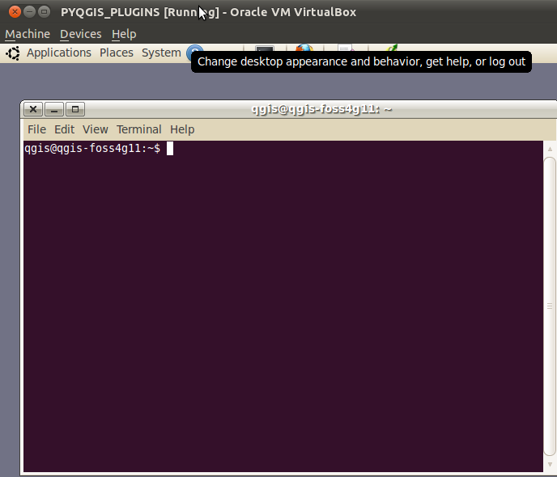
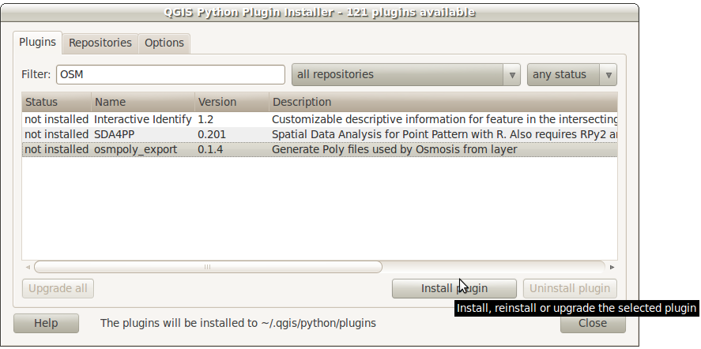

=====================================
Plugins -- Lecture and Demo
=====================================

Plugin Architecture
---------------------

QGIS Python plugins are just a set of Python modules that describe everything from our plugin resources to the code that runs the plugin logic. We'll save the details for the sections below, but here's a high-level overview of those file types.

To create QGIS Python plugins you'll need at least 4 types of files in your project (though most plugins often contain more):
    - a file with a\  ``.ui`` \extension that describes your graphical user interface (GUI). This has to be compiled into a Python module using the command-line tool\  ``pyuic4`` \.
    - a file that gives high-level configuration information about your plugin such as the name and author\  ``__init__.py`` \.
    - a file with a\  ``.qrc`` \extension describing the resources your plugin will use such as images. This has to be compiled into a Python module using the command-line tool\  ``pyrcc4`` \.
    - and finally, the meat-and-potatoes of the plugin is the file that does the actual work. This file is just a normal Python module with some specific import statements and method names. It can be named anything, though that name is usually associated with the name of your plugin.

-----------------------------

To get a better idea about how these different file types comprise a plugin project let's look at a Python plugin that is already installed on your system.  

\  **1.** \Open a new bash shell. The bash shell can be started by holding down\  ``<Cntl>-<ALT>`` \keys and then pressing\  ``t`` \at the same time. You should see a purple window pop open with a blinking cursor.

\  **2.** \Now change directories into the hidden\  ``.qgis`` \folder in your home folder. Nested inside this folder is where Python plugins are stored. List all the folders in plugins::

    $cd .qgis/python/plugins/
    $ ls -lah
    total 17K
    drwxr-xr-x 10 qgis qgis 4.0K 2011-07-17 20:40 .
    drwxr-xr-x  4 qgis qgis 4.0K 2011-07-07 13:41 ..
    drwxr-xr-x  3 qgis qgis 4.0K 2011-07-07 13:41 pluginbuilder
    

The\  **pluginbuilder** \project located in\  ``/home/qgis/.qgis/python/plugins`` \is a plugin we'll become familiar with soon. It makes creating plugins easier by automajically creating plugin template files (the file types we talked about above). The\  **pluginbuilder** \also pipes template code into the template files for us to modify.

\  **3.** \Now change directories into the\  ``pluginbuilder`` \directory and list only certain filetypes\  ``(.ui, .py and .qrc)`` \like we do below. The reason we are only listing these file types is because we don't want to see all the compiled Python modules -- those files with a\  ``.pyc`` \extension::

    $ cd pluginbuilder
    $ ls -l *.py *.ui *.qrc
    -rw-r--r-- 1 qgis qgis  1586 2011-07-07 13:41 __init__.py
    -rw-r--r-- 1 qgis qgis  1403 2011-07-07 13:41 pluginbuilder_dialog.py
    -rw-r--r-- 1 qgis qgis  7077 2011-07-07 13:41 pluginbuilder.py
    -rw-r--r-- 1 qgis qgis  2232 2011-07-07 13:41 pluginspec.py
    -rw-r--r-- 1 qgis qgis 22936 2011-07-07 13:41 resources.py
    -rw-r--r-- 1 qgis qgis   143 2011-07-07 13:41 resources.qrc
    -rw-r--r-- 1 qgis qgis  1373 2011-07-07 13:41 result_dialog.py
    -rw-r--r-- 1 qgis qgis  8718 2011-07-07 13:41 ui_pluginbuilder.py
    -rw-r--r-- 1 qgis qgis  7046 2011-07-07 13:41 ui_pluginbuilder.ui
    -rw-r--r-- 1 qgis qgis  1734 2011-07-07 13:41 ui_results.py
    -rw-r--r-- 1 qgis qgis  1880 2011-07-07 13:41 ui_results.ui

Remember, we are only interested in looking for file patterns here. As you can see there seems to be two GUI(s) associated with this plugin. We got this number by counting the files with a\  ``.ui`` \extension::

    -rw-r--r--  1 qgis qgis 6.9K 2011-07-07 13:41 ui_pluginbuilder.ui
    -rw-r--r--  1 qgis qgis 1.9K 2011-07-07 13:41 ui_results.ui

We can also see that each of the\  ``.ui`` \files have been compiled into Python modules with the same basename. From experience, I also know that if the word\  ``dialog`` \appears in any Python module it's a file that works in conjuction with our\  ``ui.py`` \file. So all of the following files seem to be related to the GUI::

    -rw-r--r-- 1 qgis qgis  1373 2011-07-07 13:41 result_dialog.py
    -rw-r--r-- 1 qgis qgis 1.4K 2011-07-07 13:41 pluginbuilder_dialog.py
    -rw-r--r--  1 qgis qgis 8.6K 2011-07-07 13:41 ui_pluginbuilder.py
    -rw-r--r--  1 qgis qgis 6.9K 2011-07-07 13:41 ui_pluginbuilder.ui
    -rw-r--r--  1 qgis qgis 1.7K 2011-07-07 13:41 ui_results.py
    -rw-r--r--  1 qgis qgis 1.9K 2011-07-07 13:41 ui_results.ui

Notice the\  ``__init__.py`` \file. If you opened this file and looked at its guts, then you'd see high-level plugin descriptions such as names and verions numbers::
    

    .. class:: expand code

    def name():
        return "Plugin Builder"
    def description():
        return "Creates a QGIS plugin template for use as a starting point in plugin development"
    def version():
        return "Version 0.3.2"
    def icon():
        return 'plugin_builder.png'
    def qgisMinimumVersion():
        return "1.0"
    def classFactory(iface):
        # load PluginBuilder class from file PluginBuilder
        from pluginbuilder import PluginBuilder
        return PluginBuilder(iface)

Also notice the resource files associated with this project below. Remember that the\  ``.qrc`` \file has to be compiled into a Python module. Here's all of those files::

    -rw-r--r--  1 qgis qgis  23K 2011-07-07 13:41 resources.py
    -rw-r--r--  1 qgis qgis  143 2011-07-07 13:41 resources.qrc

With that said, it's probably a good guess that anything else with a\  ``.py`` \extension in this directory that we didn't talk about is related to the main plugin logic. There also seems to be some documents and images that we won't be concerned with at this point.

----------------------------

Installing QGIS Plugins
------------------------------

So how did the\  ``pluginbuilder`` \plugin get installed? How did it get in this directory? 

Let's review how we install Python plugins breifly.

\  **1.** \On the menu bar of QGIS click the\  ``Plugins > Fetch Python Plugins`` \item:

.. image:: ../_static/plugins_menu_click_1.png
    :scale: 100%
    :align: center

\  **2.** \A new dialog shows up with a list of available Python plugins for install. The tutorial authors have already setup QGIS to fetch 3rd-party plugins. If the tutorial authors had not done this there would be less plugins listed here. Click on the\  ``Repository`` \tab. This lists all the plugin repositories that are being searched for plugins. At the very bottom is a\  ``3rd Party Repositories`` \button. Click this button and QGSI will begin searching 3rd-party repositories for plugins: 

.. image:: ../_static/add_3rd_partyplugins_new.png
    :scale: 100%
    :align: center

\  **3.** \Now go to the\  ``Plugins`` \tab. The plugins for each repository show up here. Choose a plugin to download. I chose to install the osmpoly_export plugin:

\  **4.** \In the bash shell or folder browser navigate to\  ``/home/qgis/.qgis/python/plugins`` \. The plugin you chose to install should now be located here::

    $ cd /home/qgis/.qgis/python/plugins/
    $ ls -lah
    total 16K
    drwxr-xr-x 4 qgis qgis 4.0K 2011-08-20 12:26 .
    drwxr-xr-x 4 qgis qgis 4.0K 2011-07-07 13:41 ..
    drwxr-xr-x 2 qgis qgis 4.0K 2011-08-20 12:26 osmpoly_export
    drwxr-xr-x 3 qgis qgis 4.0K 2011-07-07 13:41 pluginbuilder

\  **5.** \To turn any plugin on or off you can manage it by clicking\  ``Plugins > Manage Plugins`` \. The QGIS Plugin Manager dialog will launch with checkboxes next to the plugin you want to turn on or off:

.. image:: ../_static/plugin_manager_console.png
    :scale: 100%
    :align: center

