=======================================
Tutorial -- Building A Simple Plugin
=======================================

Building Our First Plugin with 'Plugin Builder'
-----------------------------------------------------

It's time to get our feet with the\  **Plugin Builder** \.

\  **1.** \On the QGIS menu bar click on the\  ``Plugin Builder`` \icon to launch the plugin:

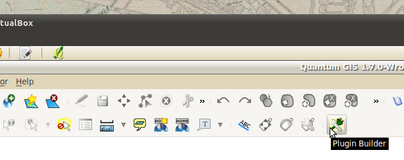

\  **2.** \The main Plugin Builder dialog will appear. This is where we fill out the basic configuration information that Plugin Builder uses to create the template files. We'll then modify the template files to build out our plugin. All the fields in the dialog below are required. Fill these fields out like the picture shows. Then click the\  ``Ok`` \button.:

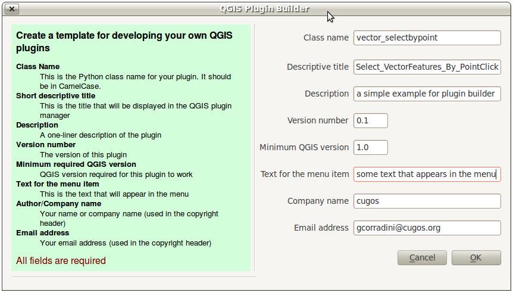

\  **3.** \A file dialog will open. Create a\  ``workspace`` \folder inside your\  ``/home/qgis/`` \directory. Save your plugin project by selecting the\  ``workspace`` \directory in the file dialog:

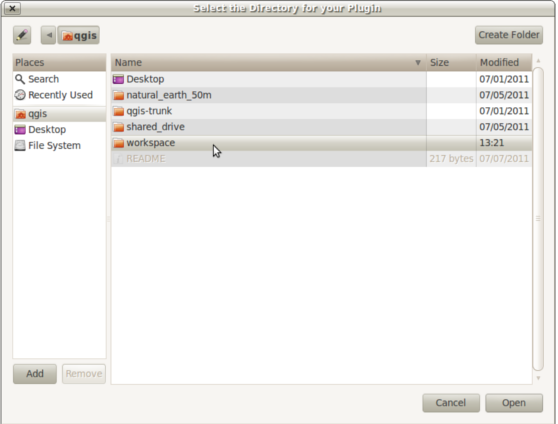

\  **4.** \If everything went well, Plugin Builder will display a final dialog that shows us the next steps to customize our plugin project. Don't worry about folowing these because we will be detailing the exact same steps.

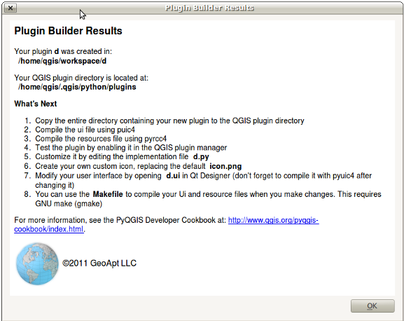

\  **5.** \Now change into the workspace directory of your project\  ``/home/qgis/workspace/vector_selectbypoint`` \and list out the contents::

    $ cd workspace/vector_selectbypoint/
    $ ls -lah
    total 36K
    drwxr-xr-x 2 qgis qgis 4.0K 2011-08-20 13:21 .
    drwxr-xr-x 3 qgis qgis 4.0K 2011-08-20 17:34 ..
    -rw-r--r-- 1 qgis qgis 1.1K 2011-08-20 13:21 icon.png
    -rw-r--r-- 1 qgis qgis 1.6K 2011-08-20 13:21 __init__.py
    -rw-r--r-- 1 qgis qgis 1.9K 2011-08-20 13:21 Makefile
    -rw-r--r-- 1 qgis qgis  116 2011-08-20 13:21 resources.qrc
    -rw-r--r-- 1 qgis qgis 1.5K 2011-08-20 13:21 ui_vector_selectbypoint.ui
    -rw-r--r-- 1 qgis qgis 1.5K 2011-08-20 13:21 vector_selectbypointdialog.py
    -rw-r--r-- 1 qgis qgis 2.6K 2011-08-20 13:21 vector_selectbypoint.py

Notice that we have a single\  ``.ui`` \file and\  ``.qrc`` \file but that they haven't been compiled yet into Python modules. Let's compile these an take a quick look at what our plugin looks like so far inside QGIS.

\  **6.** \Luckily we have a\  ``Makefile`` \in this directory that we can use to compile both files easily. From inside the directory\  ``vector_selectbypoint`` \run the following command and it will print out two statements::

    $ make
    pyuic4 -o ui_vector_selectbypoint.py ui_vector_selectbypoint.ui
    pyrcc4 -o resources.py  resources.qrc

Those two statements are the commands we need to compile the appropriate resources and GUI files. We can either run these individually or just run the\  ``Makefile`` \to start them at the same time. Every time you make changes to the\  ``resources.qrc`` \or the\  ``ui_vector_selectbypoint.ui`` \file you will need to recompile.

\  **7.** \Now relist the contents of your directory and you will see more Python modules that were created. The important ones are these Python modules::
    
    $ ls -lah
    ... # MORE FILES WERE LISTED HERE
    -rw-r--r-- 1 qgis qgis 5.4K 2011-08-20 17:42 resources.py
    -rw-r--r-- 1 qgis qgis 1.4K 2011-08-20 17:42 ui_vector_selectbypoint.py
    ... # MORE FILES WERE LISTED HERE

\  **8.** \QGIS will now be able to read the files in our project and create an appropriate button on the menu bar. However, for QGIS to notice our new plugin we will need to put the our plugin folder inside of the\  ``/home/qgis/.qgis/python/plugins`` \directory. Instead of copying all our files there let's make a symbolic link (a shortcut) from our\  ``/home/qgis/workspace/vector_selectbypoing/`` \folder to the\  ``home/qgis/.qgis/python/plugings`` \folder. This way QGIS will notice our plugin project but the files are actually still located in our workspace folder for us to edit::

     $ ln -s /home/qgis/workspace/vector_selectbypoint/ /home/qgis/.qgis/python/plugins/

\  **9.** \If we change directories to\  ``/home/qgis/.qgis/python/plugins`` \and list it's contents we should see\  ``vector_selectbypoint`` \pointing to our workspace folder::

    $ cd /home/qgis/.qgis/python/plugins
    $ ls -lah
    total 16K
    drwxr-xr-x 4 qgis qgis 4.0K 2011-08-20 17:58 .
    drwxr-xr-x 4 qgis qgis 4.0K 2011-07-07 13:41 ..
    drwxr-xr-x 2 qgis qgis 4.0K 2011-08-20 12:26 osmpoly_export
    drwxr-xr-x 3 qgis qgis 4.0K 2011-07-07 13:41 pluginbuilder
    lrwxrwxrwx 1 qgis qgis   42 2011-08-20 17:58 vector_selectbypoint -> /home/qgis/workspace/vector_selectbypoint/

\  **10.** \Go back to QGIS and add the plugin to QGIS using the plugin manager\  ``Plugins > Manage Plugins`` \. When the QGIS Plugin Manager pops up start typing\  ``Select_`` \into the filter bar at top and our plugin will come up. Check the box to the left of our plugin. Then click the\  ``OK`` \button:

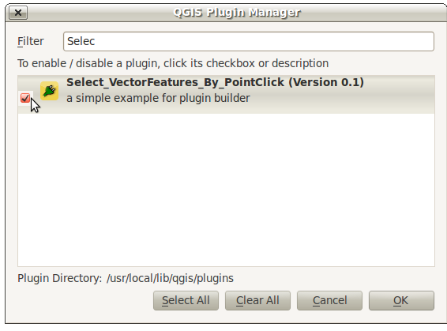

\  **11.** \You might notice that an icon has been added to the menu right next to our Plugin Builder command icon. Click this item:

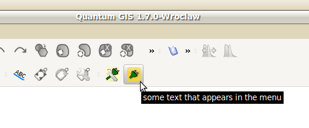

\  **12.** \If everything went well, you will see an empty dialog with an\  ``OK`` \and\  ``Cancel`` \button. As you can see the Plugin Builder doesn't give us anything off-the-shelf that is useful. We have to customize it. But at least it works (yah!):

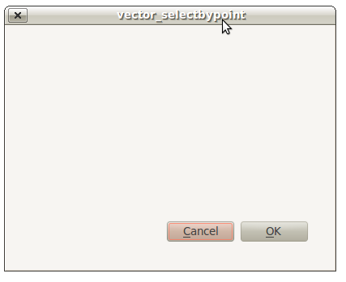

----------------------------

Extending the Plugin Builder Templates
-----------------------------------------  

The Plugin Idea and Implementation Workflow
**********************************************

The tool we're going to build will be do a few basic things:

     1. The tool will report the X,Y coords of a QgsPoint for every map click. 
     2. The tool will select any vector features that intersect with that point 
     3. The tool will have the option of being active or inactive using a checkbox setting.

.. note:: This tool will work the exact same way that the current Select Single Feature tool works in QGIS. The purpose is to illustrate the steps in fleshing out a plugin. There are more practical excercises at the end of this tutorial that will work your fu.

We can tackle the implementation tasks one at a time:

    1. Design the GUI in Qt 4 Designer by editing the\  ``.ui`` \file
    2. Implement map canvas click and point coordinate feedback
    3. Implement feature selection on map canvas click and intersect
    4. Implement making the tool inactive and active using the checkbox 
    5. Revise previous code to make our tool sexier -- Yah! 

---------------------------------------

\1) Designing the GUI
------------------------

Let's talk about what the GUI will look like. The requirements for this tool are pretty straightforward:

    1. We need a way to display point coordinate feedback to user (we are going to use a TextBrowser widget for feedback)
    2. We need a way to activate or deactivate the tool (we are going to use a checkbox widget)

If we want to make changes to the GUI we will need to edit the\  ``.ui`` \file associated with this project. Qt Designer is the editor that we are going to use to do this type of editing. 

\  **1.** \Open\  **Qt 4 Designer** \from the\  ``Applications > Programming`` \menu at the top-left of the virtual machine:

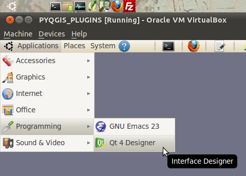

\  **2.** \A file dialog with open. Navigate to your plugin workspace at\  ``/home/qgis/workspace/vector_selectbypoint/`` \. Only the\  ``.ui`` \file associated with this project should show up in the file dialog to open. It is called\  ``ui_vector_selectbypoint.ui`` \. Select it and click\  ``Open`` \:

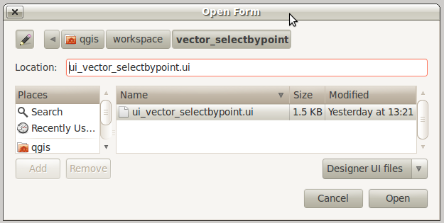

\  **3.** \The Qt form that opens should look familiar. It is basically a blank form with a couple buttons:

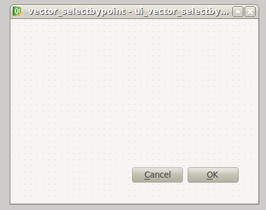

\  **4.** \We want to add a TextBrowser and CheckBox widget to this form. First drag-and-drop a TextBrowser widget on the form. Find TextBrowser in the left-hand column under the subhead\  ``Display Widgets`` \:

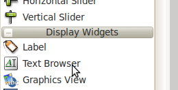

\  **5.** \Now we should have a TextBrowser object on our form like so:

.. image:: ../_static/qt_design5.png
    :scale: 100%
    :align: center

\  **6.** \With the TextBrowser on the form selected (showing the blue square vertices), move over to the bottom-right column called the\  ``Property Editor`` \and change the name of the TextBrowser object to\  ``txtFeedback`` \. The edit happens in the field called \  ``objectName`` \. The value we put in here will be used inside our code to represent the TextBrowser.

.. image:: ../_static/qt_design05.png
    :scale: 100%
    :align: center

\  **7.** \Now go back to the right-hand column and find a CheckBox widget under the subhead\  ``Buttons`` \. Drag-and-drop this on the form. The form will now look like this:

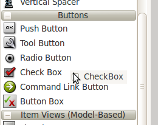

.. image:: ../_static/qt_design7.png
    :scale: 100%
    :align: center

\  **8.** \With the CheckBox on the form selected (showing the blue square vectices), go over to the\  ``Property Editor`` \and change the\  ``objectName`` \field to\  ``chkActivate`` \and the\  ``text`` \field to\  ``Activate\n(check)`` \.:

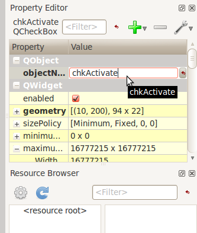

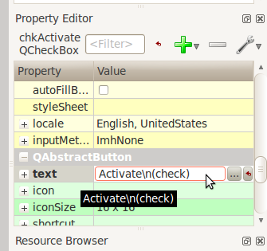

\  **9.** \Move the widgets around and stetch them to make your form look similar to this: 

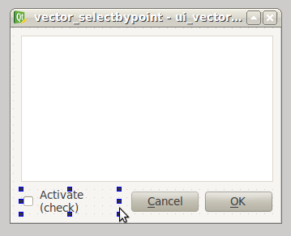

\  **10.** \Now save your changes by selecting\  ``File > Save`` \in the menu bar. 

\  **11.** \In a bash shell change directories to your workspace folder\  ``/home/qgis/workspace/vector_selectbypoint`` \and recompile everthing using the 'make' command::

    $ cd /home/qgis/workspace/vector_selectbypoint
    $ make
    pyuic4 -o ui_vector_selectbypoint.py ui_vector_selectbypoint.ui

Notice that the Makefile is smart. It knows that there were only changes to the\  ``.ui`` \file and not the\  ``.qrc`` \file. So it only compiles the GUI file into a Python module. 

---------------------------------------

\2) Implement Map Canvas Click Action 
----------------------------------------

\  **1.** \Most of you will be more comfortable browsing and editing code in a text editor like gedit. Open gedit by clicking the notepad icon on the top menue bar of Ubuntu:

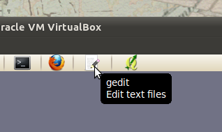

\  **2.** \Now navigate to your workspace plugin folder\  ``/home/qgis/workspace/vector_selectbypoint`` \and open the file\  ``vector_selectbypoing.py`` \. Your code should look exactly like\  `this here <../_static/mapcanvas_click_1.py>`_ 

\  **3.** \Let's walk through some important things about this file.

* QGIS needs special class methods to exist in your main Python class for it to work. These are\  ``initGui()`` \,\  ``__init__()`` \and\  ``unload`` \. If we read through the code comments in those functions we can intuit that\  ``initGui()`` \and\  ``__init__()`` \get called at plugin startup and that some of the code in the\  ``initGui()`` \function is responsible for adding our plugin to the menu. The function\  ``unload()`` \does the opposite -- it tears down things we setup at intialization. 

* Also notice that our reference to the QgsInterface class is under\  ``__init__()`` \. From this class attribute we can create a reference to other parts of the QGIS system such as the map canvas.

* Another important thing to note is that our dialog is being created under the\  ``run()`` \method with these lines::

    dlg = vector_selectbypointDialog()
    # show the dialog
    dlg.show()

* The\  ``vector_selectbypointDialog()`` \class that is being instatiated in that last code snippet was imported from our Python module dialog. If you were to open that Python module you'd notice it references the Python module that was compiled from our\  ``.ui`` \file --\  ``ui_vector_selectbypoint.py`` \. At the top of the file::

    from vector_selectbypointdialog import vector_selectbypointDialog

* Execution of the\  ``run()`` \method is then halted. It waits for some user input to move forward. That user input (in this case) is in the form of a button click. The rest of the code in the\  ``run()`` \method then decides what button was clicked\  ``Cancel == 0 and OK == 1`` \. When we first start writing plugins your code tends to fall under the\  ``run()`` \method, though you'll see it doesn't need to be put there in the future::

    result = dlg.exec_()
    # See if OK was pressed
    if result == 1:
        # do something useful (delete the line containing pass and
        # substitute with your code
        pass 

\  **4.** \Now we're going to start programming. Our tool will need a reference to the map canvas. It will also need a reference to a click tool. Make your\  ``__init__()`` \function look like this::

    def __init__(self, iface):
        # Save reference to the QGIS interface
        self.iface = iface
        # a reference to our map canvas 
        self.canvas = self.iface.mapCanvas() #CHANGE
        # this QGIS tool emits as QgsPoint after each click on the map canvas
        self.clickTool = QgsMapToolEmitPoint(self.canvas)

\  **5.** \Usually when working with QGIS GUI elements we'll need to import the\  ``qgis.gui`` \module classes and functions. The class\  ``QgsMapToolEmitPoint`` \that we used to create our point tool exits here. At the top of your\  ``vector_selectbypoint.py`` \module add this import statement under the other qgis import statements::

    from qgis.gui import *

\  **6.** \We have the references we'll need to implement a click and get some feedback in the form of a\  ``QgsPoint`` \but now we have to think about how that all works. In QGIS (and most other applications) there is the concept of an event/action.  In Qt we call these things in terms of signals and slots. When a user mouse-clicks the map canvas it broadcasts a signal about what just happened. Other functions in your program can subscribe to that broadcast and therefore react in real-time to a mouse-click. This is a concept that is not immediately intuitive or easy to program at first. So the best advice is to just follow the example below and try to understand as much as possible.  We'll return to this topic later and flesh it out more. For those that are interested here is very good resource that explains\  `PyQt signals and slots <http://www.commandprompt.com/community/pyqt/c1267>`_ \.

\  **7.** \To achieve the things we talked about in the last step we are going to need two things -- 1) some sort of way to register a custom function to the map canvas click event and 2) a custom function that gets called when a mouse-down happens on the map canvas. Maybe the best place to put any code that subscribes to a mouse click signal would be in\  ``initGui()`` \function. Add this line of code to the very end of the\  ``initGui()`` \function::

    result = QObject.connect(self.clickTool, SIGNAL("canvasClicked(const QgsPoint &, Qt::MouseButton)"), self.handleMouseDown)
    QMessageBox.information( self.iface.mainWindow(),"Info", "connect = %s"%str(result) )

A quick note. The function\  ``QObject.connect()`` \does the dirty work of registering our custom function\  ``handleMouseDown`` \(which hasn't been written yet) to the clickTool signal\  ``canvasClicked()`` \. It returns a boolean value declaring if the connection worked or not. We are catching that response and then outputing it to a message box so we can make sure the code we are writing is working as expected.

\  **8.** \Now let's write our custom function that will get called whenever a mouse-down happens on the map canvas. Create this function anywhere below\  ``initGui()`` \.::

    def handleMouseDown(self, point, button):
            QMessageBox.information( self.iface.mainWindow(),"Info", "X,Y = %s,%s" % (str(point.x()),str(point.y())) )

We know that the signal\  ``canvasClicked()`` \emits a QgsPoint. So in our\  ``handleMouseDown()`` \function we are using a message box to view the X,Y output of that point.

\  **9.** \Finally, we have to make sure the click tool we setup under\  ``__init__()`` \is enabled when our tool runs. Add this code to the very beginning under the\  ``run()`` \function::

    # make our clickTool the tool that we'll use for now 
    self.canvas.setMapTool(self.clickTool)

\  **10.** \Your entire\  ``vector_selectbypoint.py`` \module should now look\  `similar to this module <../_static/mapcanvas_click_2.py>`_

Testing Your Edits 
********************

\  **1.** \Go back to QGIS and make sure all layers are removed except the admin countries layer::

    /home/qgis/natural_earth_50m/cultural/50m_cultural/50m_admin_0_countries.shp

\  **2.** \Open the QGIS Plugin Manger. If our tool\  ``Select_VectorFeatures_By_PointClick`` \is already selected then uncheck it and close the QGIS Plugin Manager. Now reopen the QGIS Plugin manager and check our plugin again to add it to QGIS. This process ensures that we are getting the newest edits to our plugin loaded. 

\  **3.** \You should notice that as soon as you selected 'OK' on the QGIS Plugin Manager but before our plugin showed up on the menu bar that one of two things happened -- you either got an error or you saw a\  ``connect = True`` \info message box:

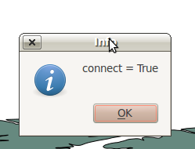

If you got an error try your best to locate the error, edit it and readd the plugin to test. If you have questions about what went wrong ask one of your neighbors or one of the helpers.

\  **4.** \Now click on our plugin button on the menu bar:

\  **5.** \You should notice two things here. Our form pops open with it's new improved look (yah!). Also notice that when the mouse hovers over the map canvas it changes into a crosshairs. Click somewhere on the map canvas and you should get a second info message box with an X,Y coordinate:

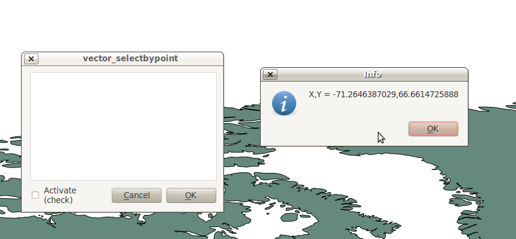

If you got an error try your best to locate the error, edit it and readd the plugin to test. If you have questions about what went wrong ask one of your neighbors or one of the helpers.

Tie QgsPoint Output to the GUI
**********************************

\  **1.** \Open the file\  ``vector_selectbypointdialog.py`` \.::

    from PyQt4 import QtCore, QtGui
    from ui_vector_selectbypoint import Ui_vector_selectbypoint
    # create the dialog for zoom to point
    class vector_selectbypointDialog(QtGui.QDialog):

        def __init__(self):
            QtGui.QDialog.__init__(self)
            # Set up the user interface from Designer.
            self.ui = Ui_vector_selectbypoint()
            self.ui.setupUi(self)

Some things to notice about this file:

    * This Python module subclasses a QtGui.QDialog class and wraps the compiled\  ``.ui`` \file\  ``ui_vector_selectbypoint.py`` \. Notice that we import that module at the beginning with these lines\  ``from ui_vector_selectbypoint import Ui_vector_selectbypoint`` \.

    * The whole point of this class is to abstract the the setup of the UI so we don't have to deal with GUI setup in our main Python module. Now when we want to create our dialog we only need to create an instance of\  ``vector_selectbypointDialog`` \class and it handles all the GUI setup. 

    * This class is a good place to build dialog-specific properties such as getters and setters for input/output and things that will interact with buttons. 

\  **2.** \Add some helper properties to set TextBrowser input. This will replace our generic QMessageBox code for our QgsPoint output. Create the necessary functions so\  ``ui_vector_selectbypoint.py`` \looks like this. Remember that\  ``txtFeedback`` \was the\  ``objectName`` \we gave to the TextBrowser object in Qt Designer::

    from PyQt4 import QtCore, QtGui
    from ui_vector_selectbypoint import Ui_vector_selectbypoint
    # create the dialog for zoom to point
    class vector_selectbypointDialog(QtGui.QDialog):

        def __init__(self):
            QtGui.QDialog.__init__(self)
            # Set up the user interface from Designer.
            self.ui = Ui_vector_selectbypoint()
            self.ui.setupUi(self)

        def setTextBrowser(self, output):
            self.ui.txtFeedback.setText(output)
         
        def clearTextBrowser(self):
            self.ui.txtFeedback.clear()

\  **3.** \Now open\  ``vector_selectbypoint.py`` \and comment out our message box code::

    #QMessageBox.information( self.iface.mainWindow(),"Info", "connect = %s"%str(result) )

    #QMessageBox.information( self.iface.mainWindow(),"Info", "X,Y = %s,%s" % (str(point.x()),str(point.y())) )

\  **4.** \Also in\  ``vector_selectbypoint.py`` \we'll want to move the creation of our dialog object from\  ``run()`` \and put it under the function\  ``__init__`` \so it can be accessible to all class functions::

    # create our GUI dialog
    self.dlg = vector_selectbypointDialog()

\  **5.** \Now that the variable\  ``dlg`` \is a class instance variable in Python we have to make sure all references to it include\  ``self.`` \. So make sure all references to\  ``dlg`` \under the\  ``run()`` \function are changed::

    # show the dialog
    self.dlg.show()
    result = self.dlg.exec_()

\  **6.** \Finally, let's redirect our QgsPoint output to the TextBrowser with our helper properties. Note, before we set the TextBrowser value we are clearing the previous value. Under the function\  ``handleMouseDown`` \rewrite your code like this::

    def handleMouseDown(self, point, button):
            self.dlg.clearTextBrowser()
            self.dlg.setTextBrowser( str(point.x()) + " , " +str(point.y()) )
            #QMessageBox.information( self.iface.mainWindow(),"Info", "X,Y = %s,%s" % (str(point.x()),str(point.y())) )

\  **7.** \Our code should now look like\  `this <../_static/mapcanvas_click_3.py>`_

\  **8.** \Save your changes. Close your files. Reload the plugin using the QGIS Plugin Manager (remember, if your plugin is already loaded -- checked -- in the plugin manager then you'll have to uncheck it, close the plugin manager, open it back up and recheck your plugin).  Now you should see your QgsPoint output in the TextBrowser on each click:

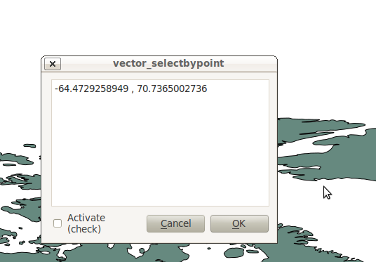

\3) Implement Feature Selection on Map Canvas Click
-----------------------------------------------------

Now the goal will be select the feature we click on in the map. There's only a couple things we need to implement in this next section:

    1. We need to a way to connect the custom function that will do the selection work to our map-canvas click event 
    2. We need to write a custom function that does our selection work

\  **1.** \First, write another connection to the\  ``canvasClicked()`` \signal. We will create our custom selection handler\  ``selectFeature()`` \in the next step. Just in case you forgot, this connection is implemented exactly the same way as\  ``handleMouseDown()`` \in the last section. Put this code at the end of\  ``initGui()`` \.::

        # connect our select function to the canvasClicked signal
        result = QObject.connect(self.clickTool, SIGNAL("canvasClicked(const QgsPoint &, Qt::MouseButton)"), self.selectFeature)
        QMessageBox.information( self.iface.mainWindow(),"Info", "connect = %s"%str(result) )
 
Notice that we are putting a QMessageBox box immediately after the connection to make sure that we are getting the correct feedback during testing.

\  **2.** \Now write the custom function to select features. To understand what the code below is doing please read the code comments. If you have questions ask about it. Everything we are doing below should be familiar because you walked through a similar example in the first hour::

     def selectFeature(self, point, button):
            QMessageBox.information( self.iface.mainWindow(),"Info", "in selectFeature function" )
            # setup the provider select 
            pntGeom = QgsGeometry.fromPoint(point)
            pntBuff = pntGeom.buffer(2.0,1) #buffer it 2 degrees and return with 1 segment
            rect = pntGeom.boundingBox()
            # get currentLayer and dataProvider
            cLayer = self.canvas.currentLayer()
            selectList = []
            if cLayer:
                    provider = cLayer.dataProvider()
                    feat = QgsFeature()
                    # create the select statement
                    provider.select([],rect) # the arguments mean no attributes returned, and do a bbox filter with our buffered rectangle to limit the amount of features  
                    while provider.nextFeature(feat):
                            # if the feat geom returned from the selection intersects our point then put it in a list
                            if feat.geometry().intersects(pntGeom):
                                    selectList.append(feat.id())

                    # make the actual selection     
                    cLayer.setSelectedFeatures(selectList)
            else:
                    QMessageBox.information( self.iface.mainWindow(),"Info", "No layer currently selected in TOC" )

\  **3.** \Your whole Python module should now look like\  `this over there <../_static/featureselect_1.py>`_

\  **4.** \Save your edits and close your files. Reload the plugin and test it. You should see at least two message boxes -- one after loading the plugin that tests the signal connection result and a second after you click the map canvas. This second message box tells us that we are\  ``in selectFeature function`` \. The code we wrote after this message box will either complete a selection or fail:

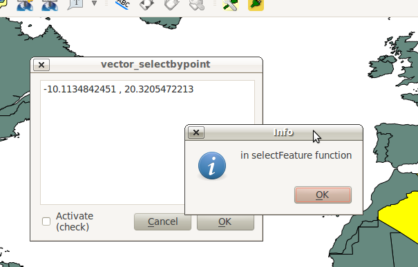

\4) Implement the Tool Activation w/ Checkbox
------------------------------------------------------

Now it's time to make our tool active/inactive depending on the state of our checkbox at the bottom left. The only portion of our tool that will become inactive is the feedback mechanism -- that means our tool will still be able to select features just not report the QgsPoint to the TextBrowser. We are only going to need two more steps for this next implementation:

1.  We need to make a connection to a checkbox signal that fires when it's clicked. The handler function will check the state (checked vs unchecked) of the checkbox. 
2.  We need to create the handler function that checks the state of the checkbox and then appropriately enables or disables a connection to the map-canvas clicked signal. That means we are going to move around some existing code. 

\  **1.** \Add a connection for the checkbox signal\  ``stateChanged()`` \at the end of\  ``initGui()`` \. The name of the function that will respond to this event is\  ``changeActive()`` \. We will create that function next::

    QObject.connect(self.dlg.getChkActivate(),SIGNAL("stateChanged(int)"),self.changeActive)

\  **2.** \While we are under\  ``initGui()`` \we are going to comment out our previous code to connect the function\  ``handleMouseDown`` \. This code will be moved under our checkbox handling function:: 

    # connect our custom function to a clickTool signal that the canvas was clicked
    # result = QObject.connect(self.clickTool, SIGNAL("canvasClicked(const QgsPoint &, Qt::MouseButton)"), self.handleMouseDown)
    # QMessageBox.information( self.iface.mainWindow(),"Info", "connect = %s"%str(result) )

\  **3.** \Now we create a custom function that fires everytime the checkbox state changes form checked to unchecked and vice versa. The idea is that if the box is checked (activated), then we need to connect\  ``handleMouseDown`` \to the map-canvas click signal. If unchecked, then disconnect from the map-canvas click signal::

    def changeActive(self,state):
        if (state==Qt.Checked):
                # connect to click signal
                QObject.connect(self.clickTool, SIGNAL("canvasClicked(const QgsPoint &, Qt::MouseButton)"), self.handleMouseDown)
        else:
                # disconnect from click signal
                QObject.disconnect(self.clickTool, SIGNAL("canvasClicked(const QgsPoint &, Qt::MouseButton)"), self.handleMouseDown)

\  **4.** \Finally, we need to make a change in\  ``vector_selectbypointdialog.py`` \and create a function that returns a reference to the checkbox object. Create this function at the end of the class::

    def getChkActivate(self):
        return self.ui.chkActivate

\  **5.** \Your code should now look similar to\  `this code <../_static/activate_click_1.py>`_

\  **6.** \Save and close your Python modules. Reload the plugin.

\  **7.** \After you intially bring up our tool the activate checkbox should be unchecked. Remember, this means we should still be able to select features just not see any feedback in the TextBrowser. Test this out:

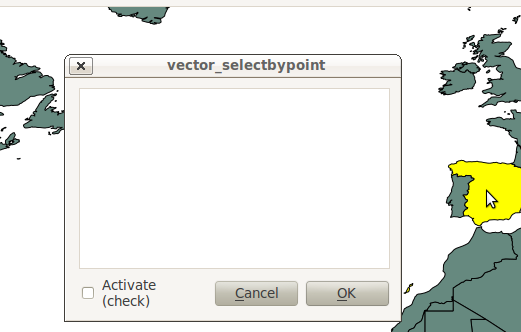

\  **8.** \Now click the checkbox and try clicking on the map again. We should now be getting X,Y point feedback in the TextBrowser and seeing features selected on the map.  

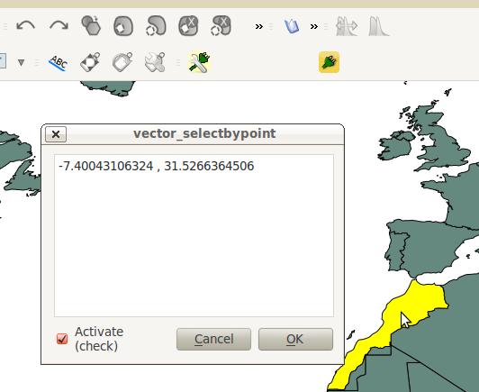

--------------------------------

\5)  Make a Sexier Tool -- Yah!
-------------------------------------

You might have noticed a couple interesting things happening in the module\  ``vector_selectbypoint.py`` \ that I find annoying. Let's talk about some changes and then move around some code in the next steps: 

    \1. Everytime we click the map canvas a signal is sent out, and our slot (or handler function)\  ``selectFeature()`` \runs and does a number of things before selecting a feature:
        * gets the current layer and sets a local function variable
        * gets the current layer's data provider and sets a local function variable

    **SOLUTION** \:This doesn't seem like the most intuitive place to get the current layer and it's data provider. Let's reorganize things around events and make this simpler. Whenever a layer is selected in the TOC it will fire a signal. This seems like a good place to put any intialization code for the current layer or data provider since we'll be handling layers one-at-a-time. 

    \2. Relaying the QgsPoint X,Y coordinates on map canvas clicks isn't putting our TextBrowser to great use.

    **SOLUTION** \:Let's output something more useful to the TextBrowser. We want to output a 'NAME' attribute to the TextBrowser if it exists for a given layer. 

------------------------------

Most of these changes are straight code reorganization. 

\  **1.** \First, let's work on our class variables -- those variables under\  ``__init__()`` \. We want to ensure that everytime a selection is made that we have a class variable to hold:

    * our list of selected features
    * our current layer
    * our current layer's data provider

The reason we want these to be class variables instead of function variables is because we want ALL functions to be able to access and make decisions based on their value. Currently all these variables are set in\  ``selectFeature()`` \function. That means we'll have to move the\  ``selectList`` \variable out from the\  ``selectFeature()`` \function and put it under\  ``__init__()`` \ as well as\  ``cLayer`` \and\  ``provider`` \variables. So make your\  ``__init__()`` function look like this::

    def __init__(self, iface):
        # Save reference to the QGIS interface
        self.iface = iface
        # refernce to map canvas
        self.canvas = self.iface.mapCanvas() 
        # out click tool will emit a QgsPoint on every click
        self.clickTool = QgsMapToolEmitPoint(self.canvas)
        # create our GUI dialog
        self.dlg = vector_selectbypointDialog()
        # create a list to hold our selected feature ids 
        self.selectList = []
        # current layer ref (set in handleLayerChange)
        self.cLayer = None
        # current layer dataProvider ref (set in handleLayerChange)
        self.provider = None 

\  **2.** \Now change all references in the module (most under\  ``selectFeature()``  \function) to be prefixed with\  ``self.`` \. 

\  **3.** \Next let's create a function called\  ``updateTextBrowser()`` \which will replace the function\  ``handleMouseDown()`` \that updates the TextBrowser with the point coordinates. Here is what that function will look like. See code comments to explain code::

    def updateTextBrowser(self):
        # if we have a selected feature
        if self.selectList:
            # find the index of the 'NAME' column, branch if has one or not
            nIndx = self.provider.fieldNameIndex('NAME')
            # get our selected feature from the provider, but we have to pass in an empty feature and the column index we want
            sFeat = QgsFeature()
            if self.provider.featureAtId(self.selectList[0], sFeat, True, [nIndx]):
                # only if we have a 'NAME' column
                if nIndx != -1:
                    # get the feature attributeMap
                    attMap = sFeat.attributeMap()
                    # clear old TextBrowser values 
                    self.dlg.clearTextBrowser()
                    # now update the TextBrowser with attributeMap[nameColumnIndex] 
                    # when we first retrieve the value of 'NAME' it comes as a QString so we have to cast it to a Python string
                    self.dlg.setTextBrowser( str( attMap[nIndx].toString() ))

\  **4.** \Because our function\  ``handleMouseDown()`` \will not be used anymore, let's make sure that we change the connections in the function\  ``changeActive()`` \to do something useful. Instead of activating/deactivating the TextBrowser feedback, I'll update this code the following way.

Comment out the following code under the\  ``initGui()`` \function::

    result = QObject.connect(self.clickTool, SIGNAL("canvasClicked(const QgsPoint &, Qt::MouseButton)"), self.selectFeature) 

Now move this code into the\  ``changeActive()`` \function to replace the previous connection. Now the function\  ``changeActive()`` \will activate/deactivate our ability to select features. Make your function look like this::

 def changeActive(self,state):
        if (state==Qt.Checked):
            # connect to click signal
            # QObject.connect(self.clickTool, SIGNAL("canvasClicked(const QgsPoint &, Qt::MouseButton)"), self.handleMouseDown)
            # connect our select function to the canvasClicked signal
            QObject.connect(self.clickTool, SIGNAL("canvasClicked(const QgsPoint &, Qt::MouseButton)"), self.selectFeature)
        else:
            # disconnect from click signal
            # QObject.disconnect(self.clickTool, SIGNAL("canvasClicked(const QgsPoint &, Qt::MouseButton)"), self.handleMouseDown)
            # disconnect our select function to the canvasClicked signal
            QObject.connect(self.clickTool, SIGNAL("canvasClicked(const QgsPoint &, Qt::MouseButton)"), self.selectFeature)

\  **5.** \The second-to-last thing we need to do is somehow call our\  ``updateTextBrowser()`` \function. We could create another connection but we want to ensure the sequential order of events here -- meaning, we want to update the TextBrowser only after the\  ``selectFeature()`` \function executes. To accomplish this we will call\  ``updateTextBrowser()`` \at the very end of the\ ``selectFeature()`` \function by changing around a couple things like so::

    if self.selectList:
            # make the actual selection 
            self.cLayer.setSelectedFeatures(self.selectList)
            # update the TextBrowser
            self.updateTextBrowser()  

Here's the whole\  ``selectFeature()`` \function so we can see the above in context::

    def selectFeature(self, point, button):
        # reset selection list on each new selection
        self.selectList = []
        #QMessageBox.information( self.iface.mainWindow(),"Info", "in selectFeature function" )
        # setup the provider select 
        pntGeom = QgsGeometry.fromPoint(point)  
        pntBuff = pntGeom.buffer(2.0,1) #buffer it 2 degrees and return with 1 segment
        rect = pntGeom.boundingBox()
        if self.cLayer:
            feat = QgsFeature()
            # create the select statement
            self.provider.select([],rect) # the arguments mean no attributes returned, and do a bbox filter with our buffered rectangle to limit the amount of features 
            while self.provider.nextFeature(feat):
                # if the feat geom returned from the selection intersects our point then put it in a list
                if feat.geometry().intersects(pntGeom):
                    self.selectList.append(feat.id())

            if self.selectList:
                # make the actual selection 
                self.cLayer.setSelectedFeatures(self.selectList)
                # update the TextBrowser
                self.updateTextBrowser()
        else:   
                QMessageBox.information( self.iface.mainWindow(),"Info", "No layer currently selected in TOC" )
    
\  **6.** \Just as an extra precaution, let's write two lines in the\  ``run()`` \function that set the current layer and data provider once the plugin is first opened. Most people will have layers already loaded before they open our plugin. Since our current layer and data provider are set automatically when a different layer is selected in the TOC, then they won't have any value to begin with. Now the\  ``run()`` \function will look like this::

    # run method that performs all the real work
    def run(self):
        # set the current layer immediately if it exists, otherwise it will be set on user selection
        self.cLayer = self.iface.mapCanvas().currentLayer()
        if self.cLayer: self.provider = cLayer.dataProvider()
        # make our clickTool the tool that we'll use for now 
        self.canvas.setMapTool(self.clickTool) 

        # show the dialog
        self.dlg.show()
        result = self.dlg.exec_()
        # See if OK was pressed
        if result == 1:
            # do something useful (delete the line containing pass and
            # substitute with your code
            pass

\  **7.** \We need to create a connection to a signal that broadcasts when a layer is changed. At the end of\  ``initGui()`` \write this code to connect a custom function we'll create next to\  ``currentLayerchanged()`` \signal of QgisInterface::

        # connect to the currentLayerChanged signal of QgsInterface
        result = QObject.connect(self.iface, SIGNAL("currentLayerChanged(QgsMapLayer *)"), self.handleLayerChange)
        # QMessageBox.information( self.iface.mainWindow(),"Info", "connect = %s"%str(result) )

\  **8.** \Our custom function to handle a layer change will look like this::

    def handleLayerChange(self, layer):
            self.cLayer = self.canvas.currentLayer()        
            if self.cLayer:
                self.provider = self.cLayer.dataProvider()

\  **9.** \The whole module should now resemble\  `this module <../_static/vector_selectbypoint(2nd_hour_ex_1).py>`_ \

\  **10.** \Test out your changes. One good test is to load two shapefile layers (hopefully both have a 'NAME' field). Then try switching between the layers and click on different features to make sure the tool works and doesn't break. 
 
