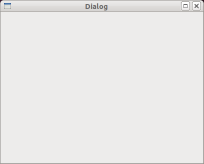

=====
PyQT
=====

What it is
------------

PyQt refers to the Python bindings that wrap the C++ Qt libraries. That means we can now use Python to build Qt applications instead of learning C++.

How it provided the idea behind PyQGIS
--------------------------------------

Using the PyQt wrappers to access QGIS libraries was a pracitical solution because QGIS was already built on top of Qt libraries. According to the\  `PyQGIS cookbook <http://www.qgis.org/pyqgis-cookbook/intro.html#python-console>`_ \, another reason for PyQt seems to be Python's immense popularity.

Examples
---------

Below are two examples: The first is an Qt XML design and the second is a PyQt module.

The XML schema is defining the layout of the graphical user interface (GUI). It was created using Qt Designer, a program that helps us build graphical user interfaces (GUIs) with drag-and-drop widgets. The widgets are then saved into an XML schema. Remember that XML, like HTML, is a language that defines data structure but not function. 

Example of QT Designer XML structure::

    <?xml version="1.0" encoding="UTF-8"?>
    <ui version="4.0">
     <class>Dialog</class>
     <widget class="QDialog" name="Dialog">
      <property name="geometry">
       <rect>
        <x>0</x>
        <y>0</y>
        <width>400</width>
        <height>300</height>
       </rect>
      </property>
      <property name="windowTitle">
       <string>Dialog</string>
      </property>
     </widget>
     <resources/>
     <connections/>
    </ui>

Once rendered, the XML structure above describes this type of GUI dialog, a very simple example:

When we have an XML structure defining our GUI we need to turn it into a python module so we can use it in PyQt applications. The PyQt module example below was produced using a helpful tool that we will be talking about later:

    * pyuic4: A Python script that compiles the QT Designer XML layouts into a Python module

If I compile this XML file using\  **pyuic4** \it will magically turn in PyQt code (Yah!). Here's the compile statement from a bash shell::

    pyuic4 -x -o form.py form.ui

Note that the -x creates an output python file that can be run directly to see an example rendering of the widget you have created.

Here is the output -- a python module::

    # -*- coding: utf-8 -*-
    
    # Form implementation generated from reading ui file 'form.ui'
    #
    # Created: Sun Sep 11 11:52:22 2011
    #      by: PyQt4 UI code generator 4.8.3
    #
    # WARNING! All changes made in this file will be lost!
    
    from PyQt4 import QtCore, QtGui
    
    try:
        _fromUtf8 = QtCore.QString.fromUtf8
    except AttributeError:
        _fromUtf8 = lambda s: s
    
    class Ui_Dialog(object):
        def setupUi(self, Dialog):
            Dialog.setObjectName(_fromUtf8("Dialog"))
            Dialog.resize(400, 300)
    
            self.retranslateUi(Dialog)
            QtCore.QMetaObject.connectSlotsByName(Dialog)
    
        def retranslateUi(self, Dialog):
            Dialog.setWindowTitle(QtGui.QApplication.translate("Dialog", "Dialog", N
    one, QtGui.QApplication.UnicodeUTF8))
    
    
    if __name__ == "__main__":
        import sys
        app = QtGui.QApplication(sys.argv)
        Dialog = QtGui.QDialog()
        ui = Ui_Dialog()
        ui.setupUi(Dialog)
        Dialog.show()
        sys.exit(app.exec_())
        
First, notice the import statement::

    from PyQt4 import QtCore, QtGui

The number in PyQt4 refers to the version we are working with and we are importing the core Qt library modules as well as those that interact with GUIs. 

Note that the above Python class is defining our dialog user interface. The following class function is building out our user interface with the buttons and comboboxes that were specificied in the XML.

Now let's jump ahead breifly to peek at some PyQGIS commands (we'll go more in depth later on this topic). What's interesting here is that we'll see PyQt objects at work in the background -- afterall, PyQGIS is build on PyQT bindings. This code is using the Python console to access the selected layer in my table of contents::

    >>> layer = qgis.utils.iface.activeLayer()
    >>> layer.getLayerID()
    PyQt4.QtCore.QString(u'TM_WORLD_BORDERS_0_3_90091320110704184935426')
    >>> layer.featureCount()
    144L
    >>> layer.srs()
    <qgis.core.QgsCoordinateReferenceSystem object at 0x3d10b78>
    >>> layer.source()
    PyQt4.QtCore.QString(u'/home/gcorradini/DATA/SHAPES/world_borders/TM_WORLD_BORDERS-0.3_900913.shp')
    >>> layer.setTransparency(50)
    >>> layer.wkbType()
    3
    >>> # 3 == MultiPolygon type
    ... 
    >>> layer.name()
    PyQt4.QtCore.QString(u'TM_WORLD_BORDERS-0.3_900913')

See all those\  ``PyQt4.QtCore.QString`` \data types in action? This is grabbing the active layer in the table of contents (active meaning selected layer). It then prints out it's layerID, feature count, spatial reference system, source path and well-known-binary type. This is only a fraction of the power we have when accessing our QGIS data layers. 

