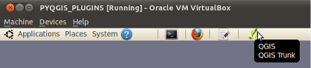
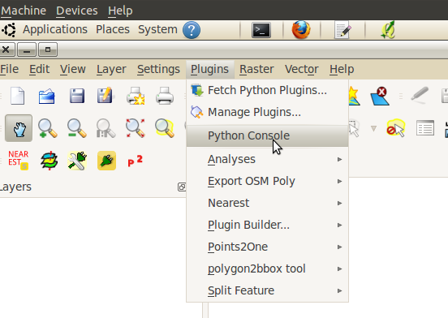
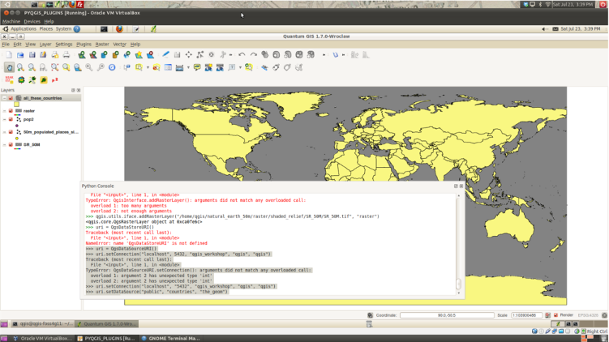
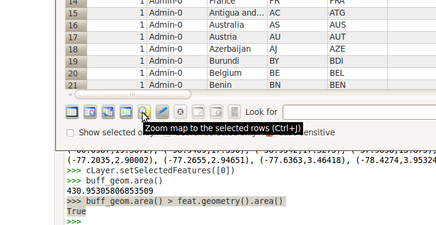
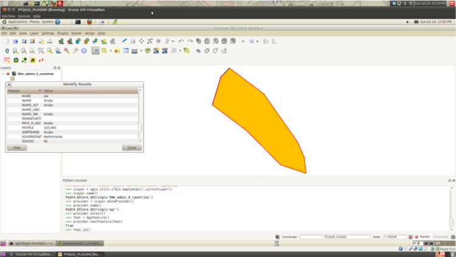
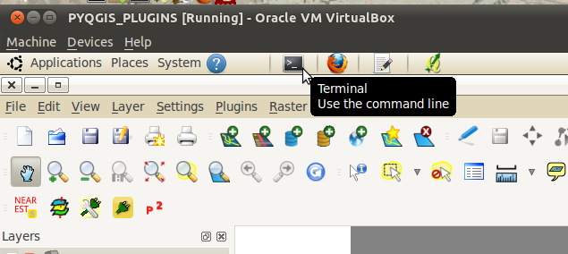

=====================================
Python in QGIS -- PyQGIS
=====================================

When we use the term\  **PyQGIS** \we are refering to the QGIS Python bindings.

Specifically, we are referring an application programming interface (API) that accesses QGIS's C/C++ library layout. Here is the QGIS library documentation: 

    http://doc.qgis.org

We will become very familiar with parts of the above documentation as we build plugins.

For now it's good to note that there's a number of ways to interact with QGIS using Python.

Here are the most common ways:

    1. \  **Python Console** \: a command-line terminal inside QGIS to test ideas and do one-off quick jobs

    2. \  **Plugins** \: enhancing/creating editing tools that interact with data inside the QGIS environment 

    3. \  **Python Scripts/Applications** \: scripts that process spatial data outside the QGIS application. Or a user could create their own stripped-down data viewer and explorer using QGIS libraries

Python Console
------------------

This is perhaps the easiest way to start testing out your ideas for plugins.

From the Python Console we can access vector and raster layers that are already loaded into QGIS. Once accessed, we can start interacting with their attributes and geometry. Since a lot of plugin work is dealing with layer attributes and geometry then let's begin.

We'll walk through the following building-block examples.

Setup
-------------

\1. To begin open up a new QGIS session by clicking the QGIS icon on the top menu bar:

All the data we will be using is located in the\  ``natural_earth_50m`` \directory of your qgis user home path::

    /home/qgis/natural_earth_50m

\2. Add the following vector and raster files to QGIS::

    /home/qgis/natural_earth_50m/raster/shaded_relief/SR_50M/SR_50M.tif
    
    # turn off the tif layer so it doesn't slow things down

    /home/qgis/natural_earth_50m/cultural/50m_cultural/50m_populated_places_simple.shp

\3. Now open the Python Console by selecting::

    Plugins > Python Console

Accessing Layers
--------------------------

.. note:: The hyperlinks that follow all reference the QGIS API Documentation. Click on them to view the classes and methods we are referencing below

There's a number of ways to access the layers in QGIS. 

All the ways start by first referencing the\  `QgsInterface class <http://doc.qgis.org/head/classQgisInterface.html>`_ \which is called\  **iface** \in the Python bindings.

From the Python Console we access\  **iface** \by calling the following command::
    
    >>> qgis.utils.iface

Type the above command into the Python Console::

    >>> qgis.utils.iface
    <qgis.gui.QgisInterface object at 0x925266c>

Running the above command prints out the actual name of the QGIS class we are dealing with -- indeed iface is the QgsInterface object 

Method 1
*********

On the iface class is a useful function called\  `activeLayer() <http://doc.qgis.org/head/classQgisInterface.html#231f32fbf95004aebb067cb98f3a391c>`_ \that returns us a reference to the selected layer in the layer legend.

\1. Run the following command::

    >>> aLayer = qgis.utils.iface.activeLayer()
    >>> aLayer
    <qgis.core.QgsRasterLayer object at 0x99ea6ec>

Depending on which layer is selected in the table of contents you will see either a raster or vector layer output. I had the raster layer selected it seems.

\2. What is the name of the active layer?::

    >>> aLayer.name()
    PyQt4.QtCore.QString(u'SR_50M')

Method 2
**********

\1. Another common way of accessing the selected layer in the table of contents is to get at it using the\  `QgsMapCanvas <http://doc.qgis.org/head/classQgsMapCanvas.html>`_ \. The mapCanvas class has tons of useful functions::

    >>> canvas = qgis.utils.iface.mapCanvas()
    >>> cLayer = canvas.currentLayer()
    >>> cLayer.name()
    PyQt4.QtCore.QString(u'SR_50M')

Method 3
**********

\1. With the map canvas class we can get more than just the active layer -- we can get everthing::

    >>> allLayers = canvas.layers()
    >>> for i in allLayers: print i.name()
    ... 
    50m_populated_places_simple

Wait a minute! We have two layers in the table of contents. Why did we only get one single name back? (this is assuming that you followed directions and kept the raster layer turned off)

It turns out that using\  ``QgsMapCanvas.layers()`` \will only return us\  **visible** \layers (those that are checked visible).

\2. Turn on the raster layer in the table of contents. Rerun the exact same two lines of code above::

    >>> allLayers = canvas.layers()
    >>> for i in allLayers: print i.name()
    ... 
    50m_populated_places_simple
    SR_50M

Now we should see both layer names printed out.

Method 4
**********

It's also useful sometimes to access layers in the order they are stacked in the table of contents.

Layers are stacked top-down and accessed through a zero-based index. That means the first layer (topmost layer) starts at index 0.

\1. We access layers using the\  `QgsMapCanvas.layer() function <http://doc.qgis.org/head/classQgsMapCanvas.html#de2251f2227bc0f0efefd09810a193cd>`_ \and pass in a integer designating the index we want::

    >>> canvas.layer(0)
    <qgis.core.QgsVectorLayer object at 0x99eaeec>
    >>> canvas.layer(0).name()
    PyQt4.QtCore.QString(u'50m_populated_places_simple')    

Other Excercises
********************

- set the active layer using qgis.utils.iface.setActiveLayer()

- set the current layer using qgis.utils.iface.setCurrentLayer()

- can you find the QgsMapLayer class in the documentation and find out how to get a layer's extent?

.. note:: There's probably many more ways to access the layers in the QGIS table of contents...so keep your eyes open for other methods

Loading Layers into QGIS
-----------------------------

Maybe when you were looking at the QgsInterface class you noticed a couple addLayer methods? Let's use these to load layers into QGIS. 

Start by turning off all layers currenlty in QGIS by unchecking them.

\1. Then with a blank map, re-add the SR_50M and populated places data as a different name::

    >>> qgis.utils.iface.addVectorLayer("/home/qgis/natural_earth_50m/cultural/50m_cultural/50m_populated_places_simple.shp", "pop2", "ogr")
    <qgis.core.QgsVectorLayer object at 0xca0feac>
    >>> qgis.utils.iface.addRasterLayer("/home/qgis/natural_earth_50m/raster/shaded_relief/SR_50M/SR_50M.tif", "raster")
    <qgis.core.QgsRasterLayer object at 0xca0fe6c>

The method\  `addVectorLayer <http://doc.qgis.org/head/classQgisInterface.html#39be50fe9974de17177861ad89e7f36e>`_ \takes three arguments:

    - the first argument is the path to the data source -- the shapefile in our case

    - the second argument is the basename -- the name that the layer takes in the table of contents

    - the third argument is the provider key. Basically, the function wants to know what driver will be used to read this data. For our purposes, the "ogr" will be used most of the time with vector data 

Notice that the\  `addRasterLayer <http://doc.qgis.org/head/classQgisInterface.html#808a34b507a8c4204d607a5857d62748>`_ \only takes two arguments -- the path and basename for the layer. 

If you go look at the\  **addRasterLayer** \function definition in the link above you'll notice that there are two overloaded function definitions for adding rasters. One definition takes two arguments (the one we used). The other definition takes many more arguments.

Adding a PostGIS Layer
***********************

You might be wondering how you would handle adding data that exists in PostGIS.

If it's vector data we just use the same function as we did above\  `addVectorLayer <http://doc.qgis.org/head/classQgisInterface.html#39be50fe9974de17177861ad89e7f36e>`_ \. However, specifying the path is a little different. 

QGIS supports the idea of uniform resource identifiers (URIs) as data-source descriptions for handling input from databases, CSVs and GPX files. The URI we pass to the database includes such parameters as the database name, username, password and the port it runs on (among other parameters).

\1. Let's load country polygons from PostgreSQL::

    >>> uri = QgsDataSourceURI()
    >>> uri.setConnection("localhost", "5432", "qgis_workshop", "qgis", "qgis")
    >>> uri.setDataSource("public", "countries", "the_geom")
    >>> uri.uri()
    PyQt4.QtCore.QString(u'dbname=\'qgis_workshop\' host=localhost port=5432 user=\'qgis\' password=\'qgis\' table="public"."countries" (the_geom) sql=')
    >>> qgis.utils.iface.addVectorLayer(uri.uri(), "all_these_countries", "postgres")
    <qgis.core.QgsVectorLayer object at 0xca0feac>

You should now have another countries layer in QGIS

Accessing Vector Geometry 
-------------------------------------------------------------

Now it's time for the really fun stuff -- playing with geometry.

The class\  `QgsGeometry <http://doc.qgis.org/head/classQgsGeometry.html>`_ \is one of the most important to study in the QGIS API. It contains the basic spatial predicates and operations for vector data that we are all used to.

For example, with the reference to the geometry of an object we can access these spatial operations (these are only some):
    - buffer
    - intersection
    - combine
    - difference 

Walking the Geometry in a Vector Layer
********************************************

There's number of ways to access a Layer's features and each feature geometry. We will NOT walk through all of them here. One way to access a layer is through the\ `QgsVectorDataProvider <http://doc.qgis.org/head/classQgsVectorDataProvider.html>`_ class. 

You can get a reference to a data provider directly from your\ `QgsVectorLayer <http://doc.qgis.org/head/classQgsVectorLayer.html>`_ class.

\1. First, remove all layers from QGIS

\2. Then add the layer called\  ``50m_admin_0_countries.shp`` \located here::

    /home/qgis/natural_earth_50m/cultural/50m_cultural/50m_admin_0_countries.shp

\3. Make sure the Python Console is open. Now get a reference to a the current layer::

    >>> cLayer = qgis.utils.iface.mapCanvas().currentLayer()
    >>> cLayer.name()
    PyQt4.QtCore.QString(u'50m_admin_0_countries')

\4. get a reference to the data provider::

    >>> provider = cLayer.dataProvider()
    >>> provider.name()
    PyQt4.QtCore.QString(u'ogr')

If this was a vector layer from postgresql then "postgres" would be the\  ``provider.name()`` \returned.

\5. One way you'll access vector layer features with through the data provider's\  `select() <http://doc.qgis.org/head/classQgsVectorDataProvider.html#ed7343c5ccea4d4fe795159eb4268b96>`_ \function::

    >>> provider.select()
    >>>

The\  ``select()`` \function reads the vector layer's attributes and geometry into memory so we can access them. If you take a look at the\  `select() API <http://doc.qgis.org/head/classQgsVectorDataProvider.html#ed7343c5ccea4d4fe795159eb4268b96>`_ you'll notice that we can refine what we actually want to get back from the layer including only certain attributes.

When we run\  ``select()`` \without any arguments passed we are only getting the default options. "Default" options in this case means::

    - Geometry -- retrieve every feature geometry
    - Attributes -- do not retrieve any attributes
    - Rectangle Filter -- do not use a spatial filter of a rectangle (thing bounding box)
    - Intersection Test -- do not run the accurate intersection test  

To summarize, when we ran\  ``select()`` \we retrieved all feature geometries but no attributes.

\6. Now let's get one feature id and geometry::

    >>> feat = QgsFeature()
    >>> # the above is an empty QgsFeature until we pass it to the provider
    >>> provider.nextFeature(feat)
    True
    >>> feat.id()
    0
    >>> feat.geometry()
    <qgis.core.QgsGeometry object at 0xca0fdec>
    >>> cLayer.setSelectedFeatures([0])

The above code retrieved the first feature from our data provider -- a feature with an featureID of 0.

We then used the\  `QgsFeature.geometry() <http://doc.qgis.org/head/classQgsFeature.html#b0a934a1b173ce5ad8d13363c20ef3c8>`_ to get it's geometry. 

Lastly, we used the current layer reference to actually select that feature in QGIS.

\7. Open the layer's attribute table and click on the 'zoom to selected features' icon on the bottom left.

It seems the island of Aruba has a featureID of 0. 

As a quick side note, here's another way to get the Aruba feature (assuming that we know the feature's ID) with the\  `featureAtId() function <http://doc.qgis.org/head/classQgsVectorDataProvider.html#583a432e2e1046392abf79bf1e58f404>`_ \of the QgsVectorDataProvider class ::

    >>> feat = QgsFeature()
    >>> provider.featureAtId(0, feat)
    True

\8. With that geometry reference we can start quality checks on the geometry to make sure we want to use it in further processing::

    >>> feat.geometry().asPolygon()
    [[(-69.8991,12.452), (-69.8957,12.423), (-69.9422,12.4385), (-70.0041,12.5005), (-70.0661,12.547), (-70.0509,12.5971), (-70.0351,12.6141), (-69.9731,12.5676), (-69.9118,12.4805), (-69.8991,12.452)]]
    >>> feat.geometry().length()
    0.53411147802819525
    >>> feat.geometry().area()
    0.012862549465307641
    >>> feat.geometry().isGeosValid()
    True
    >>> feat.geometry().isGeosEmpty()
    False
    >>> feat.geometry().isMultipart()
    False

This geometry is valid, not empty and looks to be a simple Polygon (as opposed to a MultiPolygon).

\9. To be sure that this geometry is of the 'type' we intend to use we can also use these methods to quality check::

    >>> feat.geometry().wkbType()
    3
    >>> QGis.WKBPolygon
    3
    
Note a couple things. Geometry types return an integer (essentially a lookup) that details what geometry they are. There are two ways to cross-reference this geometry type:

\A. Above we use\  `QGis.WkbType() function <http://doc.qgis.org/head/classQGis.html#8da456870e1caec209d8ba7502cceff7>`_ \to compare well-known binary types.

\B. Or we can use\ `QGis.type() function <http://doc.qgis.org/head/classQGis.html#09947eb19394302eeeed44d3e81dd74b>`_ \to compare to some basic typing::

    >>> feat.geometry().type()
    2
    >>> QGis.Polygon
    2

\10. Now let's do a very simple spatial operation like a buffer:: 

    >>> buff_geom = feat.geometry().buffer(12, 2)
    >>> buff_geom.asPolygon()
    [[(-78.2223,4.28234), (-81.4729,8.82057), (-81.5448,16.0456), (-81.5295,16.0957), (-78.8639,20.7414), (-78.8482,20.7585), (-71.1219,24.5648), (-62.8358,22.2146), (-62.7738,22.1681), (-60.16,19.4743), (-60.0987,19.3872), (-58.9469,17.356), (-58.9342,17.3275), (-57.9838,13.875), (-57.9804,13.8461), (-59.6758,6.13379), (-65.7966,1.14483), (-73.6923,1.03945), (-73.7388,1.05495), (-77.0515,3.10271), (-77.2035,2.90002), (-77.2655,2.94651), (-77.6363,3.46418), (-78.4274,3.95324), (-78.4894,4.01522), (-78.2223,4.28234)]]
    >>> buff_geom.area()
    430.95305806853509

We buffered our polygon by 12 degrees. We can see this created more vetices in the polygon list. Printing out the geometry also verifies that we expanded this polygon. Just to be sure::

    >>> buff_geom.area() > feat.geometry().area()
    True

\11. Let's test the Aruba geometry against an intersecting QgsPoint geometry as a last example::

    >>> # does the Aruba geometry intersect with Seattle (-122.361,47.642) -- I hope not!
    >>> feat.geometry().intersects(QgsGeometry.fromPoint(QgsPoint(-122.361,47.642)))
    False
    >>> # does the Aruba geometry intersect with a point inside of itself -- the real test
    >>> feat.geometry().intersects(QgsGeometry.fromPoint(QgsPoint(-69.953,12.512)))
    True

Accessing Data Attributes
-----------------------------

Raster
*********

Vector
**********

Symbology
--------------

Coordinate Reference System Transformation
------------------------------------------------

Writing Layers to File
---------------------------------

Finally, we need to be able to write the results of our operations to disk.

In this example we will write a reusable function that takes a vector layer as an argument and writes all features and attributes to disk.
First create a folder in your home direcotry called workspace.

You can either do this by using the bash shell or by using the normal folder browser.

Instructions for both ways are listed below.

Folder Browser
*******************

Click on\  ``Places > Home Folder`` \on the top menu bar

This should take you to the user's home directory. Since we are the qgis user, our home folder is called qgis::

    /home/qgis

Right click in this folder and select\  ``Create Folder`` \. Create a folder called workspace.

Inside of the\  ``workspace`` \folder create another folder called\  ``layer_exports``\.

Bash Shell
******************

Open a new bash shell by hitting\  ``<Control><Alt> + t``\.

Optionally, just open a new bash shell by selecting the terminal icon on the top menu bar

Change directories to your home folder::

    cd /home/qgis

Then make the two new directories we want::

    mkdir workspace

    mkdir /workspace/layer_exports

Writing the Copy Function
*****************************

Our copy function will take one argument -- a QgsLayer. 

Write the following function line by line into the Python Console.::

    

.. note:: Make sure after the function defintion** \  ``def copyLayer(layer):`` \ that you tab all function statements or else the interpreter will complain
