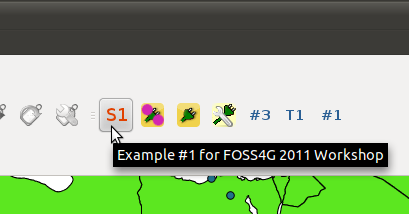

===========================
Exercise
===========================

Output Vector Layer attributes to the TextBrowser
--------------------------------------------------------

You will edit one function from the existing\  ``foss4g2011_example1_starter`` \plugin. In that function you will write the logic that reads a vector data layer's attributes and displays them to the TextBrowser output.

Goal
*************************

\  **1.** \Open the\  ``foss4g2011_example1_starter`` \plugin with some a vector layer loaded into Qgis

.. image:: ../_static/ex1_openplugin.png
    :scale: 100%
    :align: center

\  **2.** \Click somewhere on the map and you will see generic output to the TextBrowser

.. image:: ../_static/ex1_exoutput.png
    :scale: 100%
    :align: center

\  **3.** \Using gedit, navigate to\  ``/home/qgis/.qgis/python/plugins/foss4g2011_example1_starter/`` \and open the\  ``foss4g2011_example1_starter.py`` module. Find the function\  ``updateTextBrowser()`` \. This is the code you will be changing around::

    def updateTextBrowser(self):
        # check to make sure we have a feature selected in our selectList -- note that there might be more than one feature
        if self.selectList:

            # ***************EXAMPLE 1 EDITS GO HERE********************
            ''' write code that will output ALL attributes for a single selected feature into the Text Browser. 
                instead of using the dataProvider.select() function get the actual QgsFeature using dataProvider.featureAtId() '''
     
            self.dlg.setTextBrowser("example text output\n to TextBrowser")

Hints
***************

In the last hour we went through examples using\  ``dataProvider.select()`` \and\  ``dataProvider.featureAtId()`` \. Use the code below a guide for how to write your function::

        if self.selectList:

            # ############ EXAMPLE 1 EDITS GO HERE ####################  
            ''' write code that will output ALL selected feature attributes for a single feature into the Text Browser''' 
            ''' instead of using the dataProvider.select() function get the actual QgsFeature using dataProvider.featureAtId() '''
            # get all the field Indexes for the feature
            fields = self.provider.fields()
            # get the feature by passing in empty Feature
            feat = QgsFeature()
            # going to get first feature since there could potentially be more than one
            if self.provider.featureAtId(self.selectList[0], feat, True, fields.keys()):
                attMap = feat.attributeMap()
                output = "FEATURE ID: %i\n" % feat.id()
                for index,qgsfield in fields.items():
                    output += "\t" + str(qgsfield.name()) + " : " + str( (attMap[index]).toString() ) + "\n" 
                self.dlg.setTextBrowser(output)

Solution
************

There is a solution set plugin for this tool. Open this plugin and use it or browse the source code at\  ``/home/qgis/.qgis/python/plugins/foss4g2011_example1_solution/foss4g2011_example1_solution.py``\for ideas:

