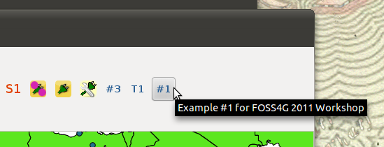
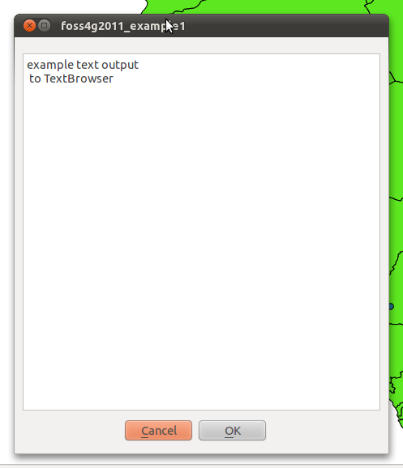

===========================
Exercise
===========================

Output Vector Layer attributes to the TextBrowser
--------------------------------------------------------

You will edit one function from the existing\  ``foss4g2011_example1`` \plugin. In that function you will write the logic that reads a vector data layer's attributes and displays them to the TextBrowser output.

Goal
*************************

\  **1.** \Open the\  ``foss4g2011_example1`` \plugin with some a vector layer loaded into Qgis

\  **2.** \Click somewhere on the map and you will see generic output to the TextBrowser

\  **3.** \Using gedit, navigate to\  ``/home/qgis/.qgis/python/plugins/foss4g2011_example1/`` \and open the\  ``foss4g2011_example1.py`` module. Find the function\  ``updateTextBrowser(0`` \. This is the code you will be changing around::

    def updateTextBrowser(self):
        # check to make sure we have a feature selected in our selectList -- note that there might be more than one feature
        if self.selectList:

            # ***************EXAMPLE 1 EDITS GO HERE********************
            ''' write code that will output ALL attributes for a single selected feature into the Text Browser. 
                instead of using the dataProvider.select() function get the actual QgsFeature using dataProvider.featureAtId() '''
     
            self.dlg.setTextBrowser("example text output\n to TextBrowser")

Hints
***************

In the last hour we went through examples using\  ``dataProvider.select()`` \and\  ``dataProvider.featureAtId()`` \. Use the code below a guide for how to write your function::

    # using the 50m_admin_0_countries.shp from natural earth download for this example
    cLayer = qgis.utils.iface.mapCanvas().currentLayer()
    provider = cLayer.dataProvider()
    selectList = [ 24, 32, 45, 56 ]
    if selectList:
        for id in selectList:
            nIndx = provider.fieldNameIndex('NAME')
            sFeat = QgsFeature()
            if provider.featureAtId(id, sFeat, True, [nIndx]):
                if nIndx != -1:
                    attMap = sFeat.attributeMap()
                    # cast QString objects to Python strings
                    print str( attMap[nIndx].toString() )

Solution
************

There is a solution set plugin for this tool. Open this plugin and use it or browse the source code at\  ``/home/qgis/.qgis/python/plugins/foss4g2011_example1_solutionset/foss4g2011_example1_solutionset.py``\for ideas:

.. image:: ../_static/raster_value_final.png
    :scale: 100%
    :align: center

