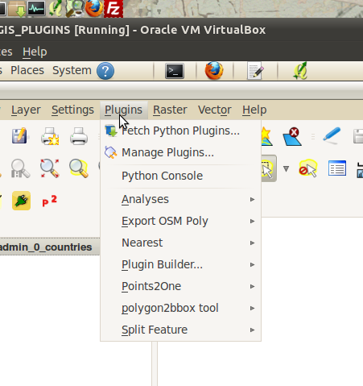
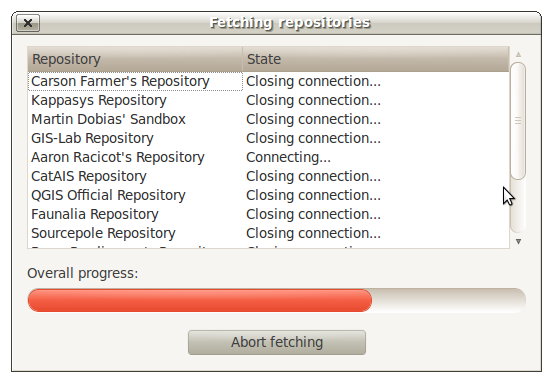
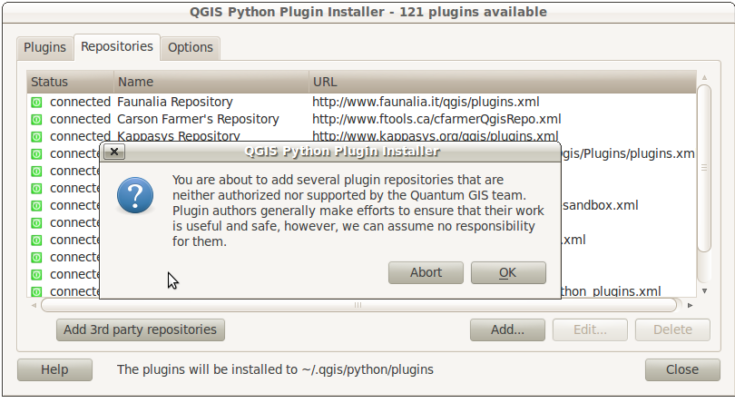
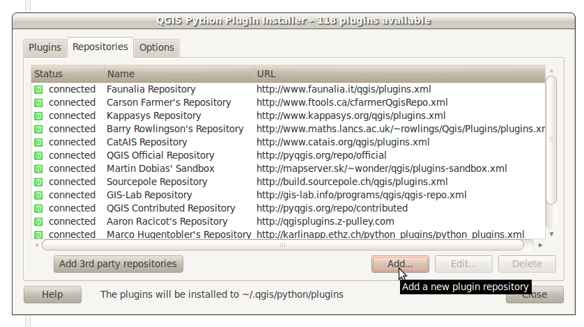
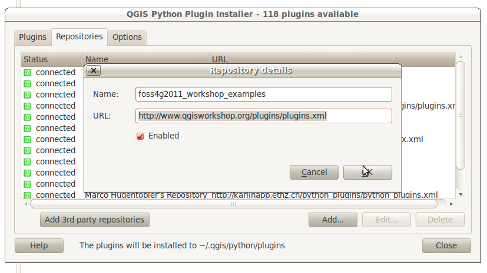
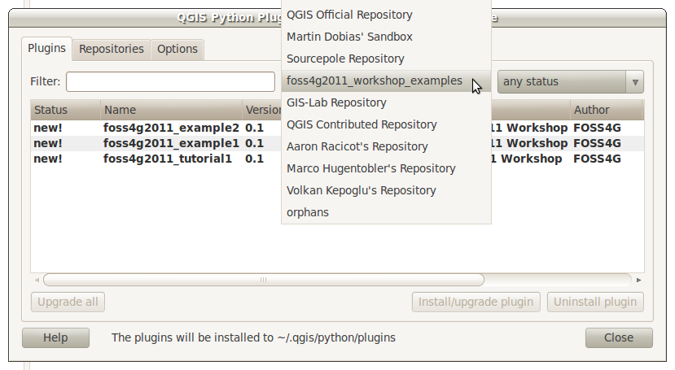
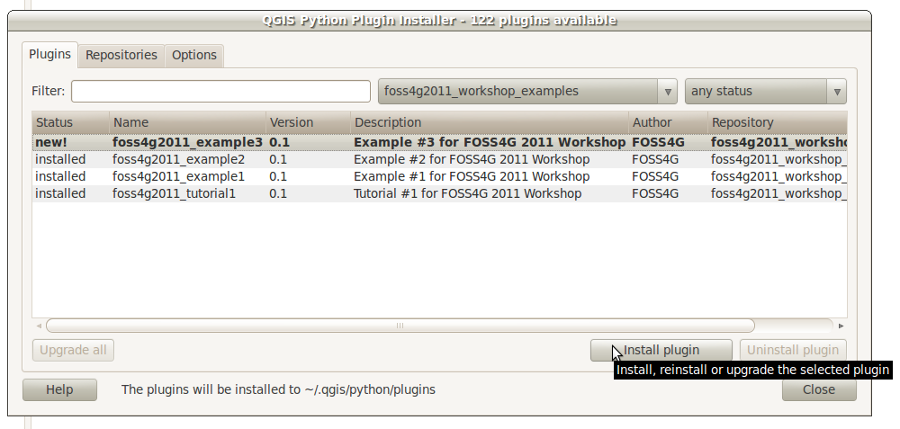
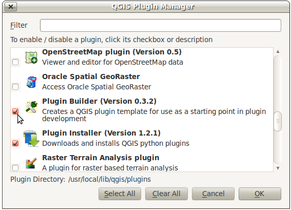

=====================================
Python in QGIS -- PyQGIS
=====================================

When we use the term\  **PyQGIS** \we are refering to the QGIS Python bindings. Specifically, we are referring to a Python application programming interface (API) that wraps the QGIS C++ library. Here is the\   `C++ QGIS API documentation <http://doc.qgis.org>`_ \.

We'll be using the C++ QGIS API documentation as a roadmap to understanding PyQGIS because the PyQGIS API documentation is nonexistent. This can be a little confusing at times. But for the most part the Python bindings are a mirror of the C++ library.

We will become very familiar with parts of the above documentation as we build plugins. For now it's good to note that there's a number of ways to interact with QGIS using Python. Here are the most common ways:

    1. \  **Python Console** \: a command-line terminal inside QGIS to test ideas and do one-off quick jobs

    2. \  **Plugins** \: creating/extending editing tools that interact with data inside the QGIS environment 

    3. \  **Python Scripts/Applications** \: writing Python applications from scratch that are built off QGIS and Qt libraries. These applications would process spatial data outside the QGIS application but use core functionality under the hood. One example would be building a stripped down QGIS viewer with a very limited toolset for a specific workflow

We'll be focusing on using the Python console during this next hour. Everything we're learning will be directly applicable to our plugin development through the rest of the workshop.

------------------------------------------------------

Python Console
------------------

This is perhaps the easiest way to test out your plugin ideas.

From the Python Console we can access vector and raster layers that are already loaded into QGIS. Once accessed, we can start interacting with their attributes and geometry. Since a lot of plugin work is dealing with layer attributes and geometry then let's begin here.

The tutorial that follows walks through the following building-block examples.

------------------------------------------------------

Installing QGIS Plugins
------------------------------

Let's review how we install Python plugins breifly. We'll also add the PyQGIS FOSS4G repository.

\  **1.** \On the QGIS menu bar click the\  ``Plugins > Fetch Python Plugins`` \item:

\  **2.** \A new dialog opens and tries to fetch all Python plugins from 3rd-party repositories. It won't be able to fetch all the plugins and should hang. Click the\  ``Abort Fetching`` \button when it begins to hang:

\  **3.** \Now you should see a list of available Python plugins for install. The tutorial authors have already setup your system to fetch 3rd-party repository plugins. If the tutorial authors hadn't done this there would be less plugins listed here. Click on the\  ``Repository`` \tab. This lists all the plugin repositories that are being searched for plugins. At the very bottom is a\  ``3rd Party Repositories`` \button. If you click this button QGIS will begin searching 3rd-party repositories for plugins: 

\  **4.** \We are going to add a new repository. This repository will contain example code for this workshop. Click the\  ``Add`` \button at the bottom right of the\  ``Repository`` \tab. Then add in the following url and a name for this repository::

    http://www.qgisworkshop.org/plugins/plugins.xml

.. note:: You can also check out the repository with your\  `web browser <http://www.qgisworkshop.org/plugins/plugins.xml`_ \

\  **5.** \If you go back to the\  ``Plugins`` \tab you can filter for\  ``foss4g2011_workshop_examples`` \in the\  ``repositories`` \drop down next to the filter textbox:

\  **6.** \Select each plugin listed under this repository and click\  ``Install Plugin`` \at the bottom right:

\  **7.** \In the bash shell or folder browser navigate to\  ``/home/qgis/.qgis/python/plugins`` \. The plugin code should now be located here::

    $ cd /home/qgis/.qgis/python/plugins/
    $ ls -lah
    total 28K
    drwxr-xr-x 7 qgis qgis 4.0K 2011-09-02 10:24 .
    drwxr-xr-x 4 qgis qgis 4.0K 2011-07-07 13:41 ..
    drwxr-xr-x 2 qgis qgis 4.0K 2011-09-02 10:21 foss4g2011_example1
    drwxr-xr-x 2 qgis qgis 4.0K 2011-09-02 10:21 foss4g2011_example2
    drwxr-xr-x 2 qgis qgis 4.0K 2011-09-02 10:24 foss4g2011_example3
    drwxr-xr-x 2 qgis qgis 4.0K 2011-09-02 10:21 foss4g2011_tutorial1
    drwxr-xr-x 3 qgis qgis 4.0K 2011-07-07 13:41 pluginbuilder

\  **8.** \To turn any plugin on or off you can manage it by clicking\  ``Plugins > Manage Plugins`` \. The QGIS Plugin Manager dialog will launch with checkboxes next to the plugin you want to turn on or off:

